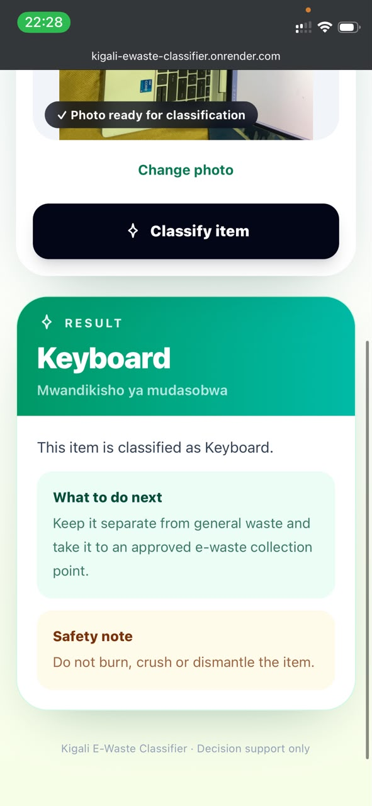
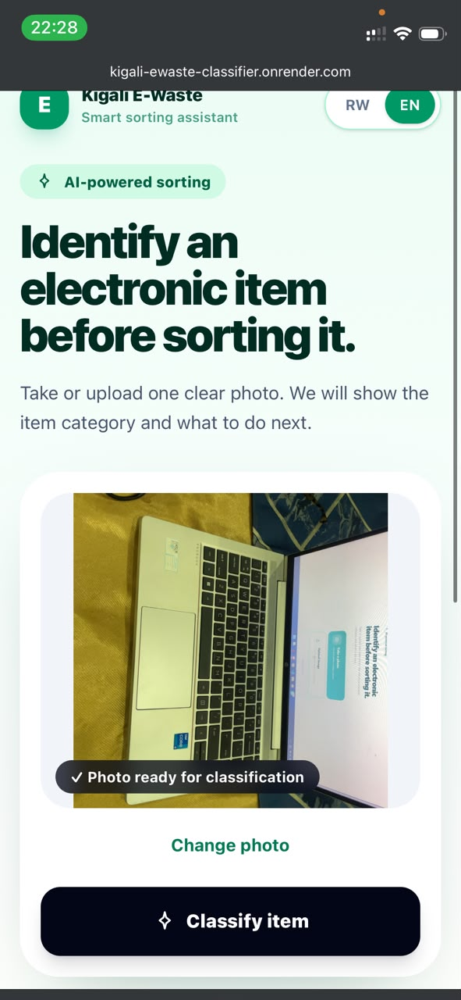

# Kigali E-waste Classifier

A mobile-first, AI-assisted e-waste classification web application designed to support informal waste pickers in Kigali. A user can take a photo with a phone or laptop camera, or upload an existing image, and receive the predicted device category together with short handling guidance.

## Live application

- **Web application:** [https://kigali-ewaste-classifier.onrender.com](https://kigali-ewaste-classifier.onrender.com)
- **Backend health check:** [https://kigali-ewaste-api.onrender.com/health](https://kigali-ewaste-api.onrender.com/health)
- **API documentation:** [https://kigali-ewaste-api.onrender.com/docs](https://kigali-ewaste-api.onrender.com/docs)

> The backend uses Render's free service and may sleep after a period of inactivity. The first prediction after it wakes may take longer than usual.

## MVP features

- Classification of one electronic item per image.
- Two image-input options:
  - open the device camera and capture a new image;
  - upload an existing image from the device.
- Mobile-first React and Tailwind CSS interface.
- Language switch between **Kinyarwanda (RW)** and **English (EN)**.
- Device names displayed in both English and Kinyarwanda.
- Short next-step and safety messages after classification.
- Low-confidence fallback that asks the user to seek human verification.
- FastAPI prediction API with automatic interactive documentation.
- HTTPS deployment so that phone browsers can request camera permission.

## Supported categories

The current model was trained to recognize these ten classes:

1. Battery
2. Keyboard
3. Microwave
4. Mobile
5. Mouse
6. PCB
7. Player
8. Printer
9. Television
10. Washing Machine

The classifier does not identify every type of electronic waste and does not determine whether an item is safe or hazardous.

## Kinyarwanda terminology

The Kinyarwanda wording was informed by [Enviroserve Rwanda's Kinyarwanda website](https://enviroserve.rw/rw/ibyerekeye-enviroserve-rwanda/), particularly its terminology for electronic waste and common electronic devices. The source uses terms such as ibisigazwa by'ibikoresho by'ikoranabuhanga (e-waste), mudasobwa (computer), terefoni (telephone), tereviziyo (television), imashini zicapa (printers) and batiri (batteries).

## MVP screenshots

### Mobile classification result



### Mobile image preview and language selector



<!-- Add additional screenshots below when the interface changes.


-->

## How it works

1. The user chooses **Take a photo** or **Upload image**.
2. The React frontend previews the selected image.
3. The image is sent as multipart form data to `POST /predict`.
4. The FastAPI backend prepares the image and sends it through the trained MobileNetV3-Small model.
5. The API returns the highest-ranked class and its confidence score.
6. If the confidence is below the configured threshold, the result is returned as unknown.
7. The interface displays the device name and the relevant guidance in the selected language.

## Model development

The model uses **MobileNetV3-Small** with transfer learning. It starts with weights pretrained on ImageNet, while the final classification layer is adapted for the ten e-waste categories. The architecture was selected because it is smaller than many general-purpose convolutional neural networks and is suitable for an early mobile-oriented application.

The dataset is already divided into training, validation and test sets:

| Split | Images |
|---|---:|
| Training | 2,400 |
| Validation | 300 |
| Test | 300 |
| **Total** | **3,000** |

Each category contains 240 training images, 30 validation images and 30 test images.

Training uses:

- PyTorch and Torchvision;
- ImageNet normalization and image augmentation;
- AdamW optimizer;
- class-weighted cross-entropy loss;
- validation macro F1-score for model selection;
- early stopping;
- a maximum of 25 epochs;
- a default batch size of 32;
- a default learning rate of `3 × 10⁻⁴`.

The best model is stored at `artifacts/best.pt` and loaded by the FastAPI backend.

## Dataset choice

The current classification milestone uses the [Kaggle E-waste Image Dataset](https://www.kaggle.com/datasets/akshat103/e-waste-image-dataset). It provides a simple folder-based classification structure and enabled the team to build and test the complete model-to-web workflow quickly.

The [Roboflow E-waste Dataset](https://universe.roboflow.com/prism-bbnrh/e-waste-dataset-r0ojc-p3l7i) is being considered for a later object-detection milestone. Detection would allow the application to locate multiple devices in one image instead of assigning one category to the entire image.

The dataset files are not required to run the trained web application. Do not commit local dataset copies to Git. Preserve the original dataset licence and attribution in project records.

## Technology stack

| Component | Technology |
|---|---|
| AI model | PyTorch, Torchvision, MobileNetV3-Small |
| Backend | Python, FastAPI, Uvicorn |
| Frontend | React, Vite, Tailwind CSS |
| Camera | Browser `getUserMedia` API |
| Deployment | Render Web Service and Render Static Site |

## Run locally

### Prerequisites

- Python 3.11
- Node.js and npm
- The trained checkpoint at `artifacts/best.pt`

### 1. Clone the repository

```bash
git clone https://github.com/charite-uwatwembi/e-waste.git
cd e-waste
```

### 2. Set up the Python environment

#### Windows PowerShell

```powershell
python -m venv .venv
& .\.venv\Scripts\Activate.ps1
python -m pip install --upgrade pip
pip install -r requirements.txt
```

#### macOS or Linux

```bash
python3 -m venv .venv
source .venv/bin/activate
python -m pip install --upgrade pip
pip install -r requirements.txt
```

For inference and deployment dependencies only, use:

```bash
pip install -r requirements-deploy.txt
```

### 3. Install frontend dependencies

Run this from the repository root:

```bash
npm install
```

### 4. Start the backend

Run this from the repository root in the first terminal.

#### Windows PowerShell

```powershell
& .\.venv\Scripts\python.exe -m uvicorn backend.app:app --reload --port 8000
```

#### macOS or Linux

```bash
python -m uvicorn backend.app:app --reload --port 8000
```

Check that the API is ready:

```text
http://127.0.0.1:8000/health
```

The interactive API documentation is available at:

```text
http://127.0.0.1:8000/docs
```

### 5. Start the frontend

Open a second terminal at the repository root:

```bash
npm run dev
```

Open the URL printed by Vite, normally:

```text
http://localhost:5173
```

If the frontend has its own `package.json`, use:

```bash
cd frontend
npm install
npm run dev
```

Camera access works on `localhost` during development. A deployed version must use HTTPS for the browser to grant camera permission.

## Train the model

Place the extracted pre-split dataset in:

```text
data/raw/modified-dataset/
├── train/
│   ├── Battery/
│   ├── Keyboard/
│   └── ...
├── val/
│   ├── Battery/
│   ├── Keyboard/
│   └── ...
└── test/
    ├── Battery/
    ├── Keyboard/
    └── ...
```

Start training from the project root:

```powershell
& .\.venv\Scripts\python.exe .\ml\train_pre_split.py --data-dir ".\data\raw\modified-dataset" --epochs 25
```

If the script is stored at the repository root instead, run:

```powershell
& .\.venv\Scripts\python.exe .\train_pre_split.py --data-dir ".\data\raw\modified-dataset" --epochs 25
```

Training produces files such as:

```text
artifacts/
├── best.pt
├── class_report.json
├── class_counts.json
├── confusion_matrix.png
└── history.json
```

The training notebook is kept for experimentation and documentation, but the Python training script is the current repeatable training method.

## API endpoints

| Method | Endpoint | Purpose |
|---|---|---|
| `GET` | `/` | Basic API information |
| `GET` | `/health` | Service, model checkpoint and device status |
| `POST` | `/predict` | Upload an image and receive a classification and guidance |
| `GET` | `/docs` | Swagger API documentation |

Example response:

```json
{
  "prediction": {
    "label_en": "Mouse",
    "label_rw": "Imbeba ya mudasobwa",
    "confidence": 0.9824
  },
  "guidance_rw": {
    "message": "Iki gikoresho ni imbeba ya mudasobwa.",
    "next_step": "Kijyane ahakusanyirizwa ibisigazwa by'ibikoresho by'ikoranabuhanga.",
    "warning": "Niba kirimo batiri, ntukimene cyangwa ngo ugishyire mu muriro."
  }
}
```

## Project structure

Generated folders such as `.venv/`, `node_modules/`, `__pycache__/`, frontend build files and local datasets are intentionally excluded from the repository.

```text
E-WASTE/
├── artifacts/
│   └── best.pt                  # Trained model checkpoint
├── backend/
│   └── app.py                   # FastAPI routes, inference and guidance
├── data/                        # Local dataset directory (not committed)
├── frontend/
│   ├── App.jsx                  # Mobile UI, camera and language switching
│   ├── index.html               # Vite HTML entry point
│   ├── main.jsx                 # React entry point
│   ├── styles.css               # Tailwind CSS import
│   └── vite.config.js           # Vite and Tailwind configuration
├── images/
│   ├── mvp-classification-result.jpeg
│   └── mvp-mobile-interface.jpeg
├── ml/
│   ├── model.py                 # MobileNetV3-Small model definition
│   ├── predict.py               # Checkpoint loading and inference
│   └── train_pre_split.py       # Pre-split dataset training script
├── .gitignore
├── .python-version              # Python version used for deployment
├── LICENSE
├── package-lock.json
├── package.json
├── README.md
├── requirements-deploy.txt      # Lightweight deployment dependencies
└── requirements.txt             # Development and training dependencies
```

## Deployment

The application is deployed as two Render services:

- The React/Tailwind frontend is a Render Static Site.
- The FastAPI/PyTorch backend is a Render Web Service.

The frontend sends images to:

```text
https://kigali-ewaste-api.onrender.com/predict
```

Render automatically deploys new commits from the configured GitHub branch. The free backend may sleep during inactivity and wake when a new request arrives.

## Safety and limitations

- The application provides decision support, not a professional hazard assessment.
- It recognizes only the ten trained categories.
- It expects one main item in each image and is not yet an object detector.
- Images captured in Kigali may differ from the training dataset in lighting, damage, viewing angle and background.
- A high confidence score does not guarantee that a prediction is correct.
- Unknown or low-confidence items should be checked by a trained person.
- Batteries, broken screens, CRT devices, leaking items, hot items and suspected refrigerant-containing equipment require approved handling procedures.
- Kinyarwanda translations and category-specific instructions should be reviewed with fluent speakers and local e-waste professionals before large-scale field use.

## Roadmap

- Collect and evaluate photographs taken in Kigali working conditions.
- Review Kinyarwanda guidance with target users and waste-management professionals.
- Improve low-confidence and out-of-distribution detection.
- Add nearby approved collection-point information.
- Improve performance on damaged and partially visible devices.
- Explore object detection using the Roboflow dataset for multiple items in one image.
- Conduct usability testing with informal waste pickers and incorporate their feedback.

## Licence

See [LICENSE](LICENSE) for the repository licence. Dataset images remain subject to their original licences and attribution requirements.
